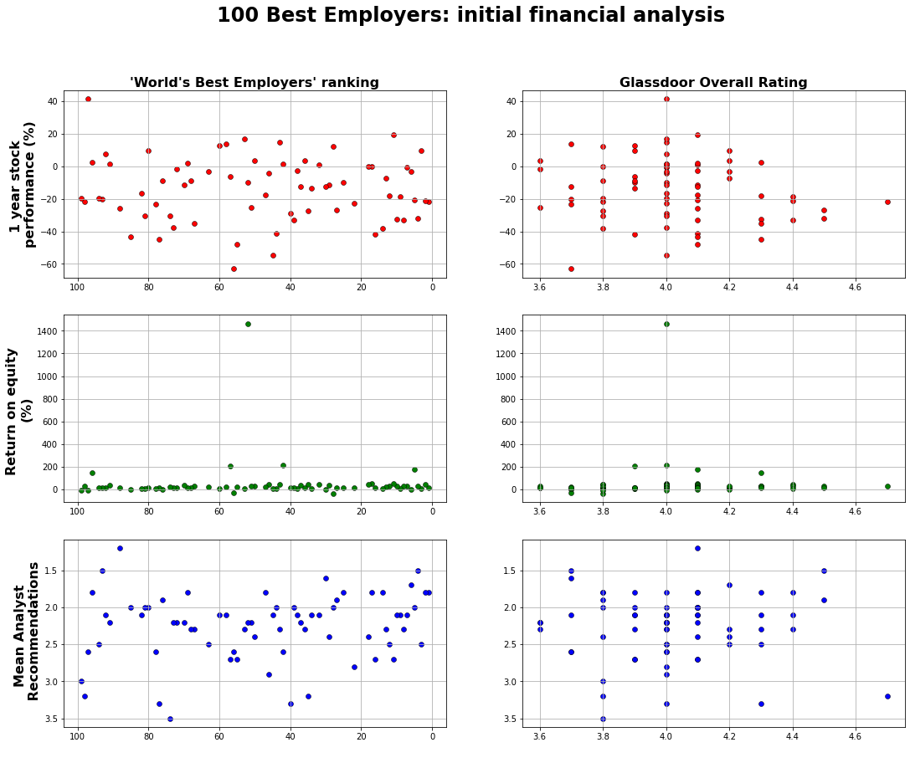

# top_100_employers_2022
## Overview
This repository contains an exploratory analysis of the [Forbes 2022 list] ('https://www.kaggle.com/datasets/devrimtuner/worlds-best-employers-top-100') of the worlds best employers. 

It was initially submitted as a group project that required us to conduct an EDA of any public dataset to answer research questions of our choosing. I have extracted the bits of the project I worked on and am building it out to answer some further questions explained below. The original rankings were compiled by Forbes, and informed by Statista, who compiled qualitative responses from employees of multinational companies on employer tenants such as: social impact, talent retention, 

Our research questions were:
1. What are the attributes of the world's best employers?
2. Do good employers make good investments?

### Part one 
Currently contained in the 'Section 1' notebook. Performs some basic cleaning and manipulation of the original csv file. Also merges it with Glassdoor Rating data and tests for correlation between 'Forbes Ranking' and 'Glassdoor employee rating.'

### Part two
The notebook file 'FinanciaL_data_section_2' retrieves financial information on all public companies in the rankings using the yFinance wrapper library, which makes an unofficial API call to the yahoo finance server. A range of financial metrics are plotted against the ranking and glassdoor data for each company.

### Part three
Part three will explore whether external factors (such as unionisation rates, average wage, liveability) affect ranking, when looked at from HQ country.
